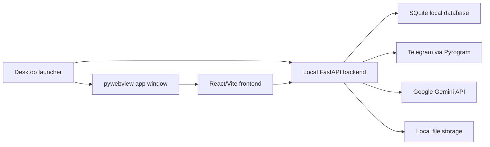

# School Manager

School Manager is a desktop application for managing Telegram communication with student groups, scheduled messages, reusable templates, and parent reports. The app is built as a local Windows/macOS desktop tool: it starts a local backend, opens a native application window, and keeps user runtime data on the user's computer.

The project was created as a practical automation tool for educational workflows: group announcements, lesson reminders, report generation, file-based templates, and Telegram delivery from one place.

## What The App Does

- Connects a Telegram account by phone number or QR code.
- Synchronizes Telegram groups and channels into a local workspace.
- Organizes recipients into categories and supports bulk group operations.
- Sends messages, files, photos, videos, GIF animations, stickers, and documents to multiple Telegram groups.
- Supports reusable templates with text and attached files.
- Creates scheduled and recurring auto-messages.
- Generates parent reports with Google Gemini based on lesson data.
- Supports lesson postponing, report queues, and follow-up messages after reports.
- Improves user-written text with a Magic editor powered by Google AI.
- Stores working data locally in SQLite.
- Exports diagnostic logs for support and troubleshooting.
- Builds for Windows and macOS from one codebase.

## Main Screens

The app contains the main working areas:

- Dashboard: quick status and operational overview.
- Messages: manual Telegram sending with recipients, files, stickers, emoji, and rich text formatting.
- Templates: reusable message templates with media attachments.
- Auto-messages: scheduled Telegram messages and follow-up messages after parent reports.
- Parent reports: local schedule table, report generation, postponed lessons, and Telegram sending.
- Logs: application events, warnings, and delivery diagnostics.
- Settings: Telegram account, Google AI, categories, startup, system notifications, and support tools.

## Tech Stack

| Layer | Technology |
| --- | --- |
| Desktop shell | Python, pywebview, pystray |
| Backend | FastAPI, SQLAlchemy, APScheduler |
| Frontend | React, Vite |
| Database | SQLite |
| Telegram integration | Pyrogram, pytgcrypto |
| AI integration | Google Gemini API |
| Packaging | PyInstaller, Inno Setup, GitHub Actions |
| Platforms | Windows, macOS |

## Architecture



The desktop launcher starts the backend on `127.0.0.1:8001`, then opens the frontend inside a native app window. The user does not need to open the app in a browser.

## Local Runtime Data

User data is runtime-only and must not be committed to GitHub or included in release artifacts.

On Windows, runtime data is stored under:

```text
%LOCALAPPDATA%\SchoolManager
```

On macOS, runtime data is stored under:

```text
~/Library/Application Support/SchoolManager
```

Runtime data can include:

- `school_manager.db`
- Telegram session files
- logs
- template files
- auto-message files
- imported temporary files
- sticker cache

The repository excludes these files through `.gitignore` and release checks.

## Development Setup

Requirements:

- Python 3.12
- Node.js 20
- Git

Install Python dependencies:

```powershell
pip install -r backend\requirements.txt
pip install pyinstaller
```

Install frontend dependencies:

```powershell
cd frontend
npm ci
cd ..
```

Build frontend:

```powershell
cd frontend
npm run build
cd ..
```

Run locally on Windows:

```powershell
.\ЗАПУСК.bat
```

Or start the desktop app directly:

```powershell
python desktop_app.py
```

The local backend runs at:

```text
http://127.0.0.1:8001
```

## Windows Build

Build frontend first:

```powershell
cd frontend
npm run build
cd ..
```

Compile-check Python files:

```powershell
python -m compileall backend desktop_app.py pyinstaller_runtime_hook.py scripts
```

Build portable app:

```powershell
pyinstaller SchoolManager.spec --noconfirm --clean
```

Build installer with Inno Setup:

```powershell
& "C:\Program Files (x86)\Inno Setup 6\ISCC.exe" installer.iss
```

## macOS Build

macOS builds are produced through GitHub Actions on a macOS runner. The workflow creates:

- `SchoolManager.app`
- unsigned `.dmg`

Unsigned macOS builds may require opening through right click -> `Open` on first launch.

## GitHub Actions

The repository includes:

```text
.github/workflows/build.yml
```

It builds:

- Windows portable package
- Windows installer
- macOS app
- macOS DMG

Manual run:

1. Open the repository on GitHub.
2. Go to `Actions`.
3. Choose `Build School Manager`.
4. Click `Run workflow`.
5. Download generated artifacts after the run succeeds.

## Release Safety Check

Before publishing a build, scan the artifact:

```powershell
python scripts\check_release_clean.py dist\SchoolManager
python scripts\check_release_clean.py dist\SchoolManager_Setup.exe
```

The checker looks for runtime databases, sessions, logs, cache folders, `.env`, tokens, and obvious API keys.

## Project Status

This is an active desktop automation project focused on educational Telegram workflows. The current priority is stable Windows operation, with macOS builds prepared through CI and tested separately.

